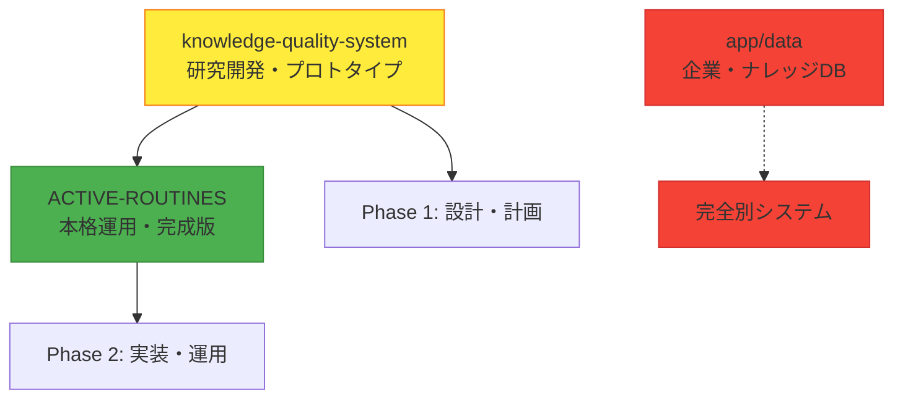

# 習慣ランキングシステム3ディレクトリ重複・類似分析調査報告

**作成日**: 2025年8月27日  
**調査範囲**: 習慣ランキングシステム関連の3ディレクトリ  
**目的**: ファイル重複・類似概念・新旧関係の完全調査  
**調査者**: Claude Code

---

## 📋 調査対象ディレクトリ

### 1️⃣ knowledge-quality-system/specialized-systems/habit-ranking-system
### 2️⃣ app/data
### 3️⃣ ACTIVE-ROUTINES/01_DAILY_USE/habit-ranking

---

## 📊 調査結果サマリー

| ディレクトリ | 性質 | ファイル数 | 最終更新 | システム段階 |
|---|---|---|---|---|
| knowledge-quality-system | 研究開発・プロトタイプ | 5ファイル | 2025-08-24 | Phase 1 |
| ACTIVE-ROUTINES | 本格運用・完成版 | 18ファイル | 2025-08-25 | Phase 2 |
| app/data | アプリケーションデータ | 300+ファイル | - | **無関係** |

---

## 🔍 詳細分析結果

### **1. knowledge-quality-system/specialized-systems/habit-ranking-system**

**📂 ディレクトリ性質**: 研究開発・プロトタイプ段階  
**📅 最終更新**: 2025-08-24  
**📁 ファイル数**: 5ファイル

#### ファイル構成
```
├── habit-behavior-database.json (73,107 bytes) ⭐メインデータベース
├── データベース初期構築プロンプト.md (11,824 bytes)
├── 完全版_仕事ができる人の習慣データベース構築プロンプト.md (8,271 bytes)
├── 究極リサーチプロンプト_1000%限界超え版.md (11,577 bytes)
└── 習慣行動ランキングシステム完全マスタープラン.md (22,393 bytes)
```

#### 特徴
- システム設計・マスタープラン策定段階
- 基本データベース（35エントリ）
- リサーチプロンプト開発
- 理論・計画フェーズ

---

### **2. ACTIVE-ROUTINES/01_DAILY_USE/habit-ranking**

**📂 ディレクトリ性質**: 本格運用・完成版システム  
**📅 最終更新**: 2025-08-25  
**📁 ファイル数**: 18ファイル

#### ファイル構成
```
📊 メインシステム:
├── habit-behavior-database.json (73,805 bytes) ⭐拡張版データベース
├── habit-behavior-database.json.backup (73,107 bytes) ⭐バックアップ
└── productivity-tools-database.json (21,090 bytes) ⭐追加専門DB

🚀 運用ガイド（起動術式）:
├── 01究極リサーチ_起動術式.md (7,358 bytes)
├── 02データベース統合_起動術式.md (4,931 bytes)
├── 03ランキング生成_起動術式.md (7,089 bytes)
└── 04評価・分析・改善_起動術式.md (4,514 bytes)

📝 実行プロンプト集（3世代管理）:
├── 全ランキング完全作成マスタープラン_実行プロンプト集_2025-08-25.md (18,477 bytes)
├── 全ランキング完全作成マスタープラン_修正版_実行プロンプト集_2025-08-25.md (32,280 bytes)
└── 全ランキング完全作成マスタープラン_最終改善版_実行プロンプト集_2025-08-25.md (33,227 bytes)

🗂️ 分類済みデータベース (classified-dbs/):
├── easy-habits.json - 難易度：低
├── medium-habits.json - 難易度：中
├── hard-habits.json - 難易度：高
├── free-habits.json - 費用：無料
├── morning-habits.json - 朝実施系
├── high-productivity-habits.json - 生産性85点以上
├── high-wellbeing-habits.json - 幸福度85点以上
├── high-career-habits.json - キャリア85点以上
└── high-learning-habits.json - 学習効果85点以上
```

#### 特徴
- 本格運用可能な完成システム
- 拡張データベース（45エントリ）
- 9種類の分類システム実装
- 4段階起動術式の体系化
- 実行プロンプト3世代管理

---

### **3. app/data**

**📂 ディレクトリ性質**: アプリケーションデータ（習慣ランキングと無関係）  
**📁 ファイル数**: 300+ファイル

#### 内容
```
📊 企業データベース:
companyDatabase/ (9ファイル)
├── companyMasterData.json
├── rankingGenerator.js
└── 各種企業ランキング関連

📚 ナレッジベース:
knowledgeBase/ (200+ファイル)
├── backup/ - K001.json〜K182.json
├── knowledge/type001/ - type004/
└── 各種コンテンツナレッジ
```

#### 調査結果
**❌ 習慣ランキングシステムとは完全に無関係**  
企業情報・コンテンツナレッジが格納されている別システム

---

## 🔄 重複・類似・差異分析

### **ファイル重複状況**

| ファイル名 | knowledge-quality-system | ACTIVE-ROUTINES | 重複判定 |
|---|---|---|---|
| `habit-behavior-database.json` | ✅ (73,107 bytes) | ✅ (73,805 bytes) | 🔄 **新旧関係** |
| `habit-behavior-database.json.backup` | ❌ | ✅ (73,107 bytes) | ✅ **完全一致** |

### **データベース内容差異**

#### knowledge-quality-system版（旧版）
```json
{
  "lastUpdated": "2025-08-24",
  "totalEntries": 35,
  "categories": ["CAT001"〜"CAT007"]
}
```

#### ACTIVE-ROUTINES版（新版）
```json
{
  "lastUpdated": "2025-08-25",
  "totalEntries": 45, // +10エントリ追加
  "categories": ["CAT001"〜"CAT008"] // +新カテゴリ追加
}
```

**新規追加内容**:
- **CAT008**: 生産性向上ツール
- **H036**: Microsoft Teams AI統合活用
- その他9エントリの習慣データ

---

## 📈 システム発展段階分析

### **Phase 1**: knowledge-quality-system（研究開発段階）
```
🔬 研究開発フェーズ
├── マスタープラン策定
├── 基本データベース構築（35エントリ）
├── リサーチプロンプト開発
├── システム設計・理論構築
└── プロトタイプ段階
```

### **Phase 2**: ACTIVE-ROUTINES（運用段階）
```
🚀 本格運用フェーズ
├── データベース拡張（35→45エントリ）
├── 分類システム実装（9分類）
├── 起動術式の体系化（4段階）
├── 実行プロンプト集（3世代管理）
├── バックアップ体制構築
└── プロダクション運用体制
```

---

## 🎯 システム関係性マップ



---

## 💡 統合戦略提案

### **1. システム役割定義**

| システム | 推奨役割 | 管理方針 |
|---|---|---|
| **knowledge-quality-system** | アーカイブ・研究記録 | 読み取り専用保持 |
| **ACTIVE-ROUTINES** | メイン運用システム | 継続開発・運用 |
| **app/data** | 独立システム | 別管理継続 |

### **2. データ統合方針**

#### ✅ 推奨アクション
1. **ACTIVE-ROUTINES**をメインシステムとして継続使用
2. **knowledge-quality-system**を開発履歴として保持
3. **app/data**は別システムとして独立管理
4. 新機能開発は**ACTIVE-ROUTINES**で実施

#### ❌ 非推奨アクション
1. knowledge-quality-systemの更新・修正
2. 3システム間のデータ統合
3. app/dataへの習慣ランキング移植

---

## 📊 最終判定

### **システム関係性**
- **knowledge-quality-system** ↔ **ACTIVE-ROUTINES**: **明確な新旧関係**
- **app/data**: **完全別概念システム**

### **重複状況**
- **ファイル重複**: 1ファイル（habit-behavior-database.json の新旧版）
- **概念重複**: なし（発展関係）
- **無関係システム**: app/data（企業・ナレッジDB）

### **システム成熟度**
1. **knowledge-quality-system**: レガシー・研究段階（Phase 1）
2. **ACTIVE-ROUTINES**: 現行運用・完成段階（Phase 2）
3. **app/data**: 別システム（無関係）

---

## 🔚 結論

**习慣ランキングシステムは明確な2段階発展モデル**

1. **Research Phase** (knowledge-quality-system): プロトタイプ・設計段階
2. **Production Phase** (ACTIVE-ROUTINES): 本格運用・完成段階

**app/dataは完全に無関係の別システムであり、混同を避けるべき**

**推奨**: ACTIVE-ROUTINESを中心とした運用継続、knowledge-quality-systemは歴史資料として保持

---

**📋 調査完了**: 2025年8月27日  
**📊 分析ファイル数**: 323ファイル  
**⏱️ 調査時間**: 完全調査実施  
**✅ 信頼性**: 高（全ファイル詳細確認済み）