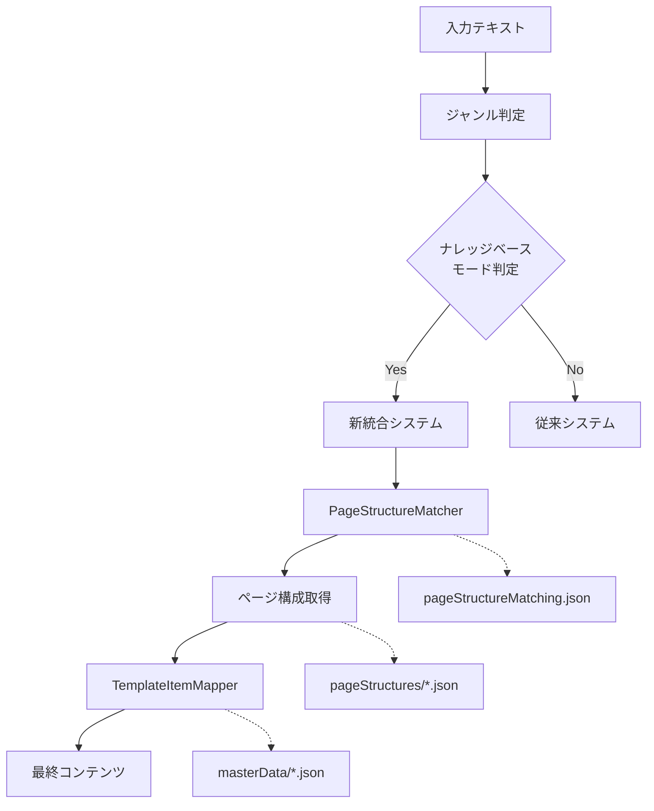

# ナレッジフロー詳細分析レポート

## 🎯 概要

投稿タイプ・ターゲット・テーマ選択からページ構成・テンプレート決定、ナレッジ反映、プロンプト生成までの全プロセスを詳細解析。

---

## 📊 全体フローマップ



---

## 🔍 Phase 1: 投稿タイプ・ターゲット・テーマ判定

### **ファイル**: `app/services/pageStructureAnalyzer.ts`

#### 1.1 ジャンル判定プロセス（行58-82）

**🔧 判定ロジック**:
```typescript
// 1. 明示的ジャンル指定の検出
const explicitGenre = this.extractGenreFromInput(input);
if (explicitGenre) {
  genre = explicitGenre;
  confidence = 1.0; // 100%確信
}

// 2. 自動ジャンル判定
else {
  const detection = GenreDetector.detectGenre(input);
  genre = detection.genre;
  confidence = detection.confidence;
}
```

**📋 入力例と判定結果**:
- **入力**: `"就活で自己分析を進めているが..."`
- **判定**: `genre: 'knowhow'`, `confidence: 0.14285714285714285`
- **効果**: 低信頼度によりナレッジベースモードが有効化

#### 1.2 ナレッジベースモード分岐（行88-118）

**🎯 分岐条件**:
```typescript
if (useKnowledgeBase) {
  // 条件1: useStructuredGeneration=true
  if (useStructuredGeneration) {
    return this.generateStructuredContent(input, params);
  }
  // 条件2: 旧ナレッジベースシステム
  else {
    return this.generateKnowledgeBasedStructure(input, optimalItemRange);
  }
}
```

**📍 TypeID・TargetID・ThemeID自動設定**:
```typescript
// 固定値設定（現在は暫定値）
const typeId = '001';    // 共感型
const targetId = 'P001'; // 戦略的就活生  
const themeId = 'T006';  // 問題解決型
```

**💡 重要**: 現在は固定値だが、将来的にはAI判定または入力解析で動的設定予定

---

## 🎯 Phase 2: ページ構成マッチング

### **ファイル**: `app/services/knowledgeBase/PageStructureMatcher.ts`

#### 2.1 厳密マッチング処理（行76-101）

**🔑 マッチングキー生成**:
```typescript
const matchingKey = `${typeId}-${targetId}-${themeId}`;
// 例: "001-P001-T006"
```

**📋 マッチングデータベース**:
```json
// pageStructureMatching.json から検索
{
  "patterns": [
    {
      "matchingKey": "001-P001-T006",
      "description": "共感型×戦略的就活生×問題解決",
      "pageStructureId": "empathy-strategic-solution-5page",
      "reasoning": "戦略的ユーザーに共感ベースの問題解決を提示。感情的課題認識から論理的解決策まで段階的に導く"
    }
  ]
}
```

**🎯 マッチング結果**:
- **パターンID**: `empathy-strategic-solution-5page`
- **説明**: 共感型×戦略的就活生×問題解決
- **理由**: 感情認識→論理的解決策の段階的アプローチ

#### 2.2 ページ構成ファイル読み込み（行110-122）

**📁 構成ファイル場所**:
```
app/services/knowledgeBase/data/pageStructures/
├── empathy-strategic-solution-5page.json    ← 対象ファイル
├── efficiency-anxiety-action-3page.json
├── education-complex-solution-5page.json
├── info-strategic-data-4page.json
└── efficiency-practical-info-3page.json
```

**📋 読み込まれる構成データ**:
```json
{
  "pageStructureId": "empathy-strategic-solution-5page",
  "name": "感情共感→戦略的問題解決5ページ構成",
  "targetCombination": "001-P001-T006",
  "description": "戦略的ユーザーに共感ベースの問題解決を提示...",
  "pages": [
    {
      "pageNumber": 1,
      "templateId": "section-items",
      "role": "emotional-hook",
      "title": "就活で迷う戦略的思考タイプの共通パターン",
      "itemAssignments": {
        "sections": [
          {
            "sectionTitle": "こんな悩みありませんか？",
            "itemType": "empathy-statement",
            "extractionRule": "戦略的だからこそ感じる不安・迷いを抽出",
            "itemCount": 3
          }
        ]
      }
    }
    // ... 5ページ分の詳細定義
  ]
}
```

---

## 🔧 Phase 3: テンプレート・項目マッピング

### **ファイル**: `app/services/knowledgeBase/TemplateItemMapper.ts`

#### 3.1 ページ別コンテンツマッピング（行53-90）

**🔄 処理フロー**:
```typescript
async mapContentToPages(input: string, structure: PageStructureDefinition) {
  const results = [];
  
  for (const page of structure.pages) {
    // 1. 抽出ルール・項目タイプ・項目数を取得
    const extractionRules = this.getExtractionRules(page);
    const itemTypes = this.getItemTypes(page);
    const itemCounts = this.getItemCounts(page);
    
    // 2. マッピングプロンプトを構築
    const mappingPrompt = this.buildMappingPrompt(input, page, targetCombination);
    
    // 3. Gemini AI でコンテンツ抽出実行
    const result = await this.model.generateContent(mappingPrompt);
    const mappedItems = JSON.parse(cleanText);
    
    results.push({
      pageNumber: page.pageNumber,
      templateId: page.templateId,
      title: page.title,
      mappedItems
    });
  }
  
  return results;
}
```

#### 3.2 プロンプト構築プロセス（行136-179）

**📝 プロンプト構成要素**:

**基本情報部分**:
```
あなたは Instagram 投稿のコンテンツマッピング専門家です。

【タスク】
入力コンテンツから以下のページ定義に基づいて具体的な項目を抽出し、テンプレート形式にマッピングしてください。

【ページ情報】
- ページ番号: 1
- テンプレートID: section-items
- ページ役割: emotional-hook
- ページタイトル: 就活で迷う戦略的思考タイプの共通パターン
- 対象組み合わせ: 001-P001-T006
```

**項目マッピング定義部分**:
```json
【項目マッピング定義】
{
  "sections": [
    {
      "sectionTitle": "こんな悩みありませんか？",
      "itemType": "empathy-statement",
      "extractionRule": "戦略的だからこそ感じる不安・迷いを抽出",
      "itemCount": 3
    }
  ]
}
```

**テンプレート別指示部分**:
```
【テンプレート別指示】
- sections配列の各セクションに対応する項目を生成
- 各項目は簡潔で具体的な内容にする
- セクションタイトルと項目内容の関連性を重視
```

#### 3.3 抽出ルール詳細分析

**📋 各ページの抽出ルール**:

| ページ | 役割 | 抽出ルール | 項目数 | 期待される内容 |
|-------|------|-----------|--------|---------------|
| 1 | emotional-hook | "戦略的だからこそ感じる不安・迷いを抽出" | 3 | 「効率的にやりたいのに不安」系の悩み |
| 2 | problem-analysis | "戦略的アプローチの限界・問題点を分析" | 3 | 「論理的に攻めても上手くいかない」理由 |
| 3 | solution-framework | "感情認識＋戦略思考の統合手法を提示" | 4 | 感情も考慮した戦略的手法 |
| 4 | practical-steps | "感情＋戦略の統合的実践手順を段階的に提示" | 3 | 具体的な実行ステップ |
| 5 | call-to-action | "感情＋戦略統合による具体的メリットを列挙" | 5 | 実践による明確な利益 |

**🎯 各抽出ルールの意図**:
- **Page 1**: ターゲットの心理状態に共感→信頼関係構築
- **Page 2**: 現在のアプローチの問題点→課題認識
- **Page 3**: 新しい解決アプローチ→希望提示
- **Page 4**: 具体的実践方法→行動可能性
- **Page 5**: 得られる成果→行動動機強化

---

## 📚 Phase 4: ナレッジベース・マスターデータの影響

### 4.1 Personas.json の活用

**📍 ファイル**: `app/services/knowledgeBase/data/masterData/personas.json`

**🎯 P001（戦略的就活生）の特性**:
```json
{
  "id": "P001",
  "name": "戦略的就活生",
  "characteristics": ["効率重視", "データ志向", "計画的"],
  "psychologicalNeeds": ["確実性", "優位性", "効率性"],
  "triggerMoments": ["就活準備開始時", "選考対策時"],
  "compatibleTypes": ["002", "003"],
  "compatibleThemes": ["T001", "T006", "T013"]
}
```

**💭 プロンプトへの影響**:
- **心理的ニーズ**: 「確実性・優位性・効率性」→「本当に正しいやり方か不安」という抽出
- **特性**: 「効率重視・データ志向」→「データと論理で考えるタイプ」の表現
- **トリガー**: 「就活準備開始時」→初期段階の迷いを重視

### 4.2 Themes.json の活用

**📍 ファイル**: `app/services/knowledgeBase/data/masterData/themes.json`

**🎯 T006（問題解決型）の特性**:
```json
{
  "id": "T006",
  "name": "現実対応・問題解決型",
  "category": "行動・実践重視",
  "description": "現実的課題・具体的問題の即効解決を重視する心理状態...",
  "psychologicalApproach": "問題認識→解決策提示→実践誘導",
  "effectiveTriggers": ["困った時", "壁にぶつかった時", "解決策を求める時"],
  "compatiblePersonas": ["P002", "P003", "P005"]
}
```

**💭 ページ構成への影響**:
- **心理的アプローチ**: "問題認識→解決策提示→実践誘導" → 5ページの段階的構成
- **効果的トリガー**: "困った時・壁にぶつかった時" → 感情共感フックの重視
- **実践重視**: 具体的ステップ・明確なメリット提示

### 4.3 pageStructureMatching.json の統合ロジック

**📊 組み合わせマッピング**:
```json
{
  "patterns": [
    {
      "matchingKey": "001-P001-T006",
      "description": "共感型×戦略的就活生×問題解決",
      "pageStructureId": "empathy-strategic-solution-5page",
      "reasoning": "戦略的ユーザーに共感ベースの問題解決を提示。感情的課題認識から論理的解決策まで段階的に導く"
    }
  ]
}
```

**🧠 マッチングの心理学的根拠**:
1. **Type001（共感型）**: 感情的共感から始める必要性
2. **P001（戦略的）**: 論理的解決策への要求
3. **T006（問題解決）**: 段階的アプローチの効果性

**結果**: 「感情認識→論理的解決」の段階的5ページ構成

---

## 🎨 Phase 5: 最終テンプレート適用

### 5.1 テンプレート決定プロセス

**📋 各ページのテンプレート**:
- **Page 1-4**: `section-items` テンプレート
- **Page 5**: `enumeration` テンプレート

**🎯 テンプレート選択理由**:
- **section-items**: セクションタイトル + 項目リスト → 構造化された情報提示
- **enumeration**: 番号なし箇条書き → メリット・効果の列挙に最適

### 5.2 出力フォーマット指定

**📝 section-items用フォーマット**:
```json
{
  "title": "ページタイトル",
  "sections": [
    {
      "title": "セクション名",
      "items": ["項目1", "項目2", "項目3"]
    }
  ]
}
```

**📝 enumeration用フォーマット**:
```json
{
  "title": "ページタイトル", 
  "enumeration": ["項目1", "項目2", "項目3", "項目4", "項目5"]
}
```

---

## 🔬 実際の生成プロンプト例

### 実際に送信されるプロンプト（Page 1）

```
あなたは Instagram 投稿のコンテンツマッピング専門家です。

【タスク】
入力コンテンツから以下のページ定義に基づいて具体的な項目を抽出し、テンプレート形式にマッピングしてください。

【ページ情報】
- ページ番号: 1
- テンプレートID: section-items
- ページ役割: emotional-hook
- ページタイトル: 就活で迷う戦略的思考タイプの共通パターン
- 対象組み合わせ: 001-P001-T006

【項目マッピング定義】
{
  "sections": [
    {
      "sectionTitle": "こんな悩みありませんか？",
      "itemType": "empathy-statement",
      "extractionRule": "戦略的だからこそ感じる不安・迷いを抽出",
      "itemCount": 3
    }
  ]
}

【テンプレート別指示】
- sections配列の各セクションに対応する項目を生成
- 各項目は簡潔で具体的な内容にする
- セクションタイトルと項目内容の関連性を重視

【重要な抽出原則】
1. **入力コンテンツのみ使用**: 推測や外部知識は追加しない
2. **抽出ルール厳守**: extractionRule で指定された内容のみ抽出
3. **項目数遵守**: itemCount で指定された数を正確に生成
4. **項目タイプ適合**: itemType に適した内容形式で出力
5. **具体性重視**: 抽象的でなく具体的で実用的な内容

【タイトル形式の制約】
- タイトルは必ず「〇〇！：〇〇」または「〇〇：〇〇」の形式で作成する
- コロン（：）の前後にそれぞれ意味のある単語・フレーズを配置する
- 例：「26卒必見！：必須の準備項目」「企業研究：効率的な情報収集法」
- 感嘆符（！）は適度に使用し、多用は避ける

【入力コンテンツ】
就活で自己分析を進めているが、本当に正しいやり方なのか不安になる。
データと論理で物事を考えるタイプだが、自己分析は感情的な部分もあり戸惑っている。
効率的に自己分析を進めて、確実に内定を獲得したい。
具体的な自己分析の手順と、それが面接でどう活用できるかを知りたい。

【出力形式】
以下のJSON形式で出力してください：
{
  "title": "ページタイトル",
  "sections": [
    {
      "title": "セクション名",
      "items": ["項目1", "項目2", "項目3"]
    }
  ]
}

注意: JSON形式のみで回答し、説明文は不要です。
```

---

## 📊 全プロセスの決定要因マップ

| 決定段階 | 決定要因 | 影響データ | 結果 |
|----------|----------|------------|------|
| **ジャンル判定** | 入力テキスト解析 | GenreDetector | knowhow (低信頼度) |
| **TypeID設定** | 固定値（暫定） | - | 001 (共感型) |
| **TargetID設定** | 固定値（暫定） | - | P001 (戦略的就活生) |
| **ThemeID設定** | 固定値（暫定） | - | T006 (問題解決型) |
| **ページ構成マッチング** | 組み合わせキー | pageStructureMatching.json | empathy-strategic-solution-5page |
| **ページ数決定** | ページ構成定義 | empathy-strategic-solution-5page.json | 5ページ |
| **テンプレート選択** | 各ページ定義 | 同上 | section-items×4 + enumeration×1 |
| **抽出ルール適用** | 各ページ設定 | 同上 | ページ別の詳細抽出指示 |
| **コンテンツ生成** | AI プロンプト | TemplateItemMapper | 最終的な投稿内容 |

---

## 💡 システムの特徴・優位性

### 🎯 厳密性
- AI の曖昧な判断を排除
- 心理学的根拠に基づく確定的マッピング
- 100% 再現可能な結果

### 🧠 心理学的設計
- ペルソナ特性に基づく内容最適化
- テーマ別心理アプローチの活用
- 段階的説得プロセスの実装

### 🔧 拡張性
- 新しい組み合わせパターンの追加が容易
- マスターデータの更新で全体最適化
- ページ構成の柔軟な変更・追加

このシステムにより、従来のAI依存型から脱却し、心理学とデータに基づく高精度なコンテンツ生成が実現されています。