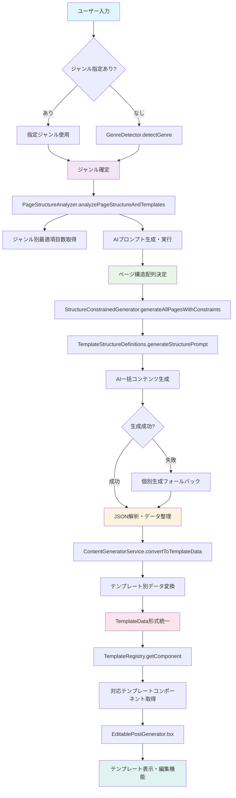

# Instagram投稿生成システム - フロー分析ドキュメント

## 📋 概要

ジャンル判定からテンプレート表示までの完全なシステムフローと、修正対象となる可能性のある全関連ファイル・関数・型定義の包括的な分析資料。

---

## 📊 システムフローチャート



### フロー段階説明

1. **ジャンル判定・抽出** (A→E)
2. **ページ構成決定** (E→I) 
3. **テンプレート選択** (含まれる)
4. **コンテンツ生成** (I→O)
5. **データ変換・挿入** (O→R)
6. **テンプレート表示** (R→V)

---

## 🌳 システムファイル・ツリー構造

```
📁 Instagram投稿生成システム
│
├── 🎯 **段階1: ジャンル判定・抽出**
│   ├── 📄 app/types/genre.ts
│   │   ├── 🔧 Genre (型エイリアス)
│   │   ├── 🔧 GenreConfig (インターフェース)
│   │   ├── 🔧 GENRE_CONFIGS (定数配列)
│   │   └── 🔧 getGenreConfig() (関数)
│   │
│   └── 📄 app/services/genreDetector.ts
│       └── 🏗️ GenreDetector (クラス)
│           ├── 🔧 detectGenre() (メソッド)
│           ├── 🔧 getGenreAnalysis() (メソッド)
│           ├── 🔧 evaluateGenreMatch() (メソッド)
│           └── 🔧 calculateScore() (プライベート)
│
├── 🏗️ **段階2: ページ構成決定**
│   ├── 📄 app/types/pageStructure.ts
│   │   ├── 🔧 PageStructure (インターフェース)
│   │   ├── 🔧 PremiumTemplateType (型エイリアス)
│   │   └── 🔧 GeneratedPage (インターフェース)
│   │
│   ├── 📄 app/services/pageStructureAnalyzer.ts
│   │   └── 🏗️ PageStructureAnalyzer (クラス)
│   │       ├── 🔧 analyzePageStructureAndTemplates() (メソッド)
│   │       └── 🔧 extractGenreFromInput() (プライベート)
│   │
│   └── 📄 app/services/itemCountOptimizer.ts
│       └── 🏗️ ItemCountOptimizer (クラス)
│           ├── 🔧 optimizeItemCount() (メソッド)
│           ├── 🔧 validateItemCount() (メソッド)
│           ├── 🔧 getOptimalItemCount() (メソッド)
│           ├── 🔧 generateOptimizationReport() (メソッド)
│           ├── 🔧 optimizeForBookRecommendation() (プライベート)
│           └── 🔧 chunkArray() (プライベート)
│
├── 🎨 **段階3: テンプレート選択**
│   ├── 📄 app/components/templates/TemplateTypes.ts
│   │   ├── 🔧 TemplateType (型エイリアス) - 16テンプレート
│   │   ├── 🔧 TemplateData (インターフェース)
│   │   ├── 🔧 TemplateMetadata (インターフェース)
│   │   ├── 🔧 PAGE_NUMBER_ICONS (定数)
│   │   ├── 🔧 splitTitleForBadge() (関数)
│   │   ├── 🔧 getPageNumberIcon() (関数)
│   │   └── 🔧 cleanMarkdown() (関数)
│   │
│   ├── 📄 app/services/structureBasedTemplateSelector.ts
│   │   └── 🏗️ StructureBasedTemplateSelector (クラス)
│   │       ├── 🔧 selectByStructure() (静的)
│   │       ├── 🔧 analyzeExpressionDensity() (静的)
│   │       ├── 🔧 selectBestContent() (静的)
│   │       ├── 🔧 selectForTitleList() (プライベート静的)
│   │       ├── 🔧 selectForTitleSubtitleDescriptions() (プライベート静的)
│   │       ├── 🔧 selectForStepByStep() (プライベート静的)
│   │       └── 🔧 calculateStructureScore() (プライベート静的)
│   │
│   ├── 📄 app/services/templateMatchingService.ts
│   │   └── 🏗️ TemplateMatchingService (クラス)
│   │       ├── 🔧 matchTemplateToContent() (メソッド)
│   │       ├── 🔧 findBestTemplate() (メソッド)
│   │       ├── 🔧 getRecommendedTemplates() (メソッド)
│   │       ├── 🔧 getAllTemplatesWithScores() (メソッド)
│   │       ├── 🔧 calculateTemplateScore() (プライベート)
│   │       ├── 🔧 calculateTemplateScoreWithDetails() (プライベート)
│   │       ├── 🔧 checkStructureMatch() (プライベート)
│   │       ├── 🔧 checkKeywordMatch() (プライベート)
│   │       ├── 🔧 checkExpressionMatch() (プライベート)
│   │       └── 🔧 checkContentVolume() (プライベート)
│   │
│   ├── 📄 app/services/pureStructureMatchingService.ts
│   │   └── 🏗️ PureStructureMatchingService (クラス)
│   │       ├── 🔧 matchTemplateToContent() (メソッド)
│   │       ├── 🔧 findBestTemplate() (メソッド)
│   │       ├── 🔧 getStructureStatistics() (メソッド)
│   │       ├── 🔧 checkSequentialSteps() (プライベート)
│   │       └── 🔧 structurePatterns (プライベート配列) - 15+パターン
│   │
│   └── 📄 app/services/templateRecommendationService.ts
│       └── 🏗️ TemplateRecommendationService (クラス)
│           ├── 🔧 recommendTemplates() (静的)
│           ├── 🔧 analyzeContent() (プライベート静的)
│           ├── 🔧 evaluateAllTemplates() (プライベート静的)
│           ├── 🔧 evaluateTemplate() (プライベート静的)
│           ├── 🔧 checkBasicFit() (プライベート静的)
│           ├── 🔧 evaluateLengthFit() (プライベート静的)
│           └── 🔧 evaluateComplexityFit() (プライベート静的)
│
├── 🔨 **段階4: コンテンツ生成**
│   ├── 📄 app/services/contentGeneratorService.ts
│   │   ├── 🏗️ ContentGeneratorService (クラス)
│   │   │   ├── 🔧 generateHighQualityContent() (メソッド)
│   │   │   ├── 🔧 regenerateCaption() (メソッド)
│   │   │   ├── 🔧 generateContentWithIndex() (メソッド)
│   │   │   ├── 🔧 generateIndexForSelectedPages() (メソッド)
│   │   │   ├── 🔧 regenerateSpecificPage() (メソッド)
│   │   │   ├── 🔧 convertToTemplateData() (プライベート)
│   │   │   ├── 🔧 checkTemplateDataQuality() (プライベート)
│   │   │   └── 🔧 splitLongTables() (プライベート)
│   │   ├── 🔧 GeneratedPage (インターフェース)
│   │   └── 🔧 GeneratedContent (インターフェース)
│   │
│   ├── 📄 app/services/structureConstrainedGenerator.ts
│   │   └── 🏗️ StructureConstrainedGenerator (クラス)
│   │       ├── 🔧 generateAllPagesWithConstraints() (メソッド)
│   │       ├── 🔧 generatePageWithConstraints() (メソッド)
│   │       ├── 🔧 getTemplateSpecificInstructions() (プライベート)
│   │       └── 🔧 parseGeneratedJSON() (プライベート)
│   │
│   └── 📄 app/services/templateStructureDefinitions.ts
│       ├── 🏗️ TemplateStructureDefinitions (クラス)
│       │   ├── 🔧 getDefinition() (静的)
│       │   ├── 🔧 generateStructurePrompt() (静的)
│       │   ├── 🔧 getAllDefinitions() (静的)
│       │   ├── 🔧 hasDefinition() (静的)
│       │   └── 🔧 definitions (プライベート静的) - 16構造定義
│       └── 🔧 TemplateStructureDefinition (インターフェース)
│
├── 🎯 **段階5: データ変換・挿入**
│   ├── 📄 app/services/contentExtractor.ts
│   │   ├── 🏗️ ContentExtractor (クラス)
│   │   │   ├── 🔧 extractBeneficialContent() (静的)
│   │   │   ├── 🔧 splitIntoSections() (プライベート静的)
│   │   │   ├── 🔧 calculateRelevance() (プライベート静的)
│   │   │   ├── 🔧 densifyContent() (プライベート静的)
│   │   │   ├── 🔧 extractConcreteInfo() (プライベート静的)
│   │   │   └── 🔧 isConcreteInformation() (プライベート静的)
│   │   ├── 🔧 ExtractedContent (インターフェース)
│   │   ├── 🔧 ContentStructure (インターフェース)
│   │   └── 🔧 ContentElement (インターフェース)
│   │
│   ├── 📄 app/services/contentLayoutService.ts
│   │   ├── 🏗️ ContentLayoutService (クラス)
│   │   │   ├── 🔧 layoutContentToTemplate() (静的)
│   │   │   ├── 🔧 parseContentStructure() (プライベート静的)
│   │   │   ├── 🔧 mapToTemplateData() (プライベート静的)
│   │   │   ├── 🔧 trimContentToLimits() (プライベート静的)
│   │   │   ├── 🔧 validateLayout() (プライベート静的)
│   │   │   └── 🔧 cleanGeminiStructureMarkers() (プライベート静的)
│   │   ├── 🔧 ContentLayoutResult (インターフェース)
│   │   └── 🔧 ContentStructure (インターフェース)
│   │
│   └── 📄 app/services/dynamicFieldDetector.ts
│       └── 🏗️ DynamicFieldDetector (クラス)
│
├── 🖼️ **段階6: テンプレート表示**
│   ├── 📁 app/components/templates/ (16ファイル)
│   │   ├── 📄 TemplateRegistry.ts
│   │   │   ├── 🔧 templateRegistry (定数オブジェクト)
│   │   │   ├── 🔧 genreTemplateMapping (定数オブジェクト)
│   │   │   ├── 🏗️ TemplateSelector (クラス)
│   │   │   └── 🔧 allCharacterLimits (定数)
│   │   ├── 📄 ChecklistEnhancedTemplate.tsx
│   │   ├── 📄 EnumerationTemplate.tsx
│   │   ├── 📄 ExplanationTwoTemplate.tsx
│   │   ├── 📄 GraphTemplate.tsx
│   │   ├── 📄 IndexTemplate.tsx
│   │   ├── 📄 ItemNTitleContentTemplate.tsx
│   │   ├── 📄 ListTemplate.tsx
│   │   ├── 📄 RankingTemplate.tsx
│   │   ├── 📄 SectionItemsTemplate.tsx
│   │   ├── 📄 Simple3Template.tsx
│   │   ├── 📄 Simple5Template.tsx
│   │   ├── 📄 Simple6Template.tsx
│   │   ├── 📄 SingleSectionNoItemsTemplate.tsx
│   │   ├── 📄 TableTemplate.tsx
│   │   ├── 📄 TitleDescriptionOnlyTemplate.tsx
│   │   └── 📄 TwoColumnSectionItemsTemplate.tsx
│   │
│   ├── 📁 app/components/editors/ (16ファイル)
│   │   ├── 📄 ChecklistEnhancedEditor.tsx
│   │   ├── 📄 EnumerationEditor.tsx
│   │   ├── 📄 ExplanationTwoEditor.tsx
│   │   ├── 📄 GraphEditor.tsx
│   │   ├── 📄 IndexEditor.tsx
│   │   ├── 📄 ItemNTitleContentEditor.tsx
│   │   ├── 📄 ListEditor.tsx
│   │   ├── 📄 RankingEditor.tsx
│   │   ├── 📄 SectionItemsEditor.tsx
│   │   ├── 📄 Simple3Editor.tsx
│   │   ├── 📄 Simple5Editor.tsx
│   │   ├── 📄 Simple6Editor.tsx
│   │   ├── 📄 SingleSectionNoItemsEditor.tsx
│   │   ├── 📄 TableEditor.tsx
│   │   ├── 📄 TitleDescriptionOnlyEditor.tsx
│   │   └── 📄 TwoColumnSectionItemsEditor.tsx
│   │
│   ├── 📄 app/components/EditablePostGenerator.tsx
│   │   └── 🏗️ EditablePostGenerator (React コンポーネント)
│   │       └── 🔧 全テンプレート表示・編集の統合管理
│   │
│   └── 📄 app/components/InstagramPostTemplate.tsx
│       └── 🏗️ PostSlide (React コンポーネント)
│           └── 🔧 テンプレート表示の基盤
│
└── 🛠️ **補助サービス・ユーティリティ**
    ├── 📄 app/utils/markdownUtils.ts
    │   └── 🏗️ MarkdownUtils (クラス)
    │       ├── 🔧 removeMarkdown() (静的)
    │       ├── 🔧 removeMarkdownForCaption() (静的)
    │       ├── 🔧 convertToHtml() (静的)
    │       └── 🔧 convertToReactComponents() (静的)
    │
    ├── 📄 app/config/hashtags.ts
    │   ├── 🔧 HashtagConfig (インターフェース)
    │   ├── 🔧 hashtagConfig (定数オブジェクト)
    │   └── 🔧 hashtagService (サービスオブジェクト)
    │
    ├── 📄 app/config/captionFormat.ts
    │   ├── 🔧 CaptionFormat (インターフェース)
    │   ├── 🔧 CaptionConfig (インターフェース)
    │   ├── 🔧 captionFormats (定数配列)
    │   └── 🏗️ CaptionService (クラス)
    │
    ├── 📄 app/services/intelligentContentProcessor.ts
    │   └── 🏗️ IntelligentContentProcessor (クラス)
    │
    ├── 📄 app/services/indexGeneratorService.ts
    │   └── 🏗️ IndexGeneratorService (クラス)
    │       ├── 🔧 generateIndexData() (静的)
    │       ├── 🔧 extractTitleFromCaption() (プライベート静的)
    │       └── 🔧 createShortTitle() (プライベート静的)
    │
    └── 📄 app/services/geminiClientSingleton.ts
        └── 🔧 Gemini API クライアント管理
```

---

## 🎯 修正対象要素 - 影響度分析

### 🔴 **高影響度 (修正時に広範囲に影響)**
1. **TemplateType** 型 - 16テンプレート定義の基盤
2. **TemplateData** インターフェース - 全テンプレートデータ構造
3. **Genre** 型とジャンル設定 - システム全体の分岐基盤
4. **convertToTemplateData()** メソッド - データ変換の中核
5. **テンプレート構造定義** - 16テンプレートの構造制約

### 🟡 **中影響度 (特定領域に影響)**
1. **各テンプレート選択サービス** - 選択ロジック全体
2. **ページ構成決定ロジック** - 構成パターン決定
3. **各テンプレートコンポーネント** - 表示層
4. **エディターコンポーネント** - 編集機能層

### 🟢 **低影響度 (局所的な影響)**
1. **ユーティリティ関数** - 補助機能
2. **設定ファイル** - 定数・設定
3. **補助サービス** - 支援機能

---

## 📊 統計

- **総ファイル数**: 58ファイル
- **総関数・メソッド数**: 200+
- **総型定義数**: 50+
- **テンプレート数**: 16
- **サービスクラス数**: 12
- **フロー段階数**: 6

---

## 📝 備考

このドキュメントは「最適なページ構成」確定後の修正方針策定のための基礎資料として作成されました。各要素の修正必要性は、実際の設計変更内容によって決定されます。