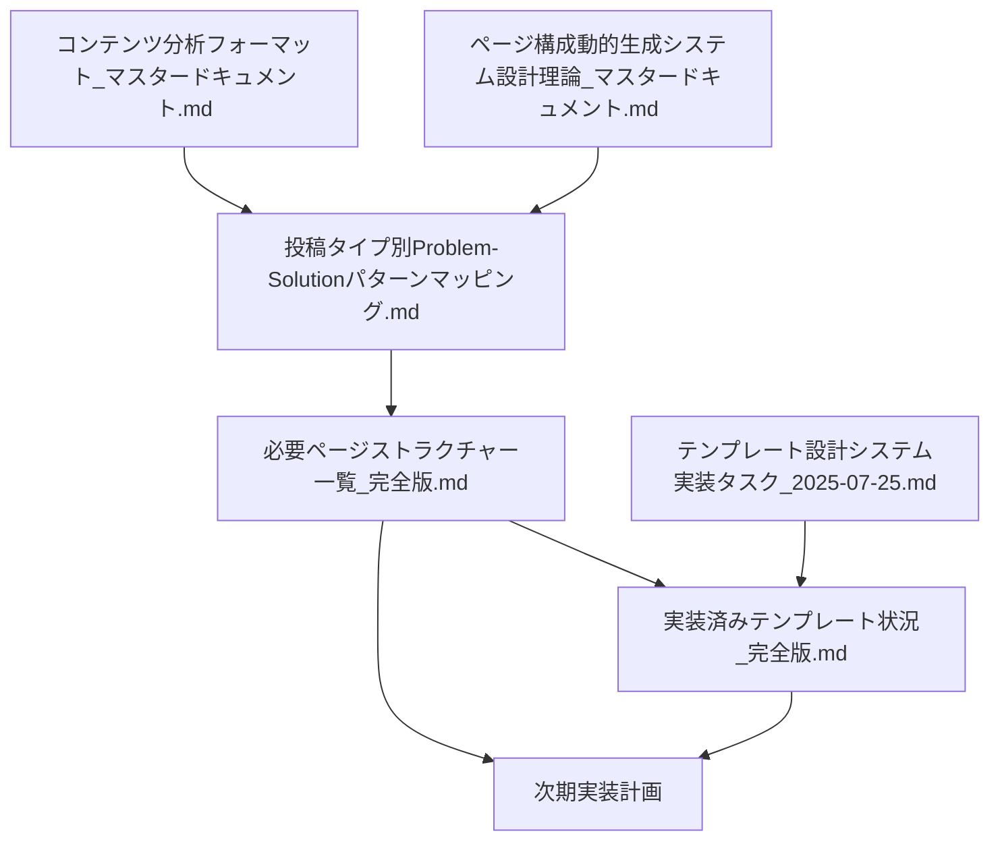

# ワークスペース INDEX - 2025-07-25

## 📋 セッション概要
**目的**: ナレッジベース対応テンプレートシステムの開発・標準化  
**作業期間**: 2025年7月25-26日  
**完了状況**: ✅ K002実装完了・標準プロセス確立完了  

---

## 🗂️ メインドキュメント一覧

### **📊 分析・設計系ドキュメント**

#### 1. **投稿タイプ別Problem-Solutionパターンマッピング.md** 
- **場所**: `/mnt/c/instagram-course/instagram-post-generator/投稿タイプ別Problem-Solutionパターンマッピング.md`
- **内容**: 全116ナレッジの15パターン完全分類
- **重要度**: ★★★★★ (最高)
- **更新状況**: ✅ TypeID=003&004分析完了
- **キーポイント**: 
  - TypeID=003: 3パターン（体系化18件、実践12件、データ6件）
  - TypeID=004: 3パターン（ツール16件、企業11件、活用7件）

#### 2. **必要ページストラクチャー一覧_完全版.md**
- **場所**: `/mnt/c/instagram-course/instagram-post-generator/docs/workspace-2025-07-25/必要ページストラクチャー一覧_完全版.md`
- **内容**: 全15パターンのテンプレート設計仕様
- **重要度**: ★★★★★ (最高)
- **キーポイント**: 
  - 最優先4パターンで70.7%のナレッジをカバー
  - 実装優先度付きリスト
  - 命名規則と構造分類の標準化

#### 3. **実装済みテンプレート状況_完全版.md**
- **場所**: `/mnt/c/instagram-course/instagram-post-generator/docs/workspace-2025-07-25/実装済みテンプレート状況_完全版.md`
- **内容**: 現在のテンプレート実装状況とギャップ分析
- **重要度**: ★★★★★ (最高)
- **キーポイント**: 
  - 実装済み18個、未実装7個（重要分）
  - Phase 1実装で70.7%カバー可能
  - 実装工数見積もり付き

### **📋 設計・理論系ドキュメント**

#### 4. **ページ構成動的生成システム設計理論_マスタードキュメント.md**
- **場所**: `/mnt/c/instagram-course/instagram-post-generator/ページ構成動的生成システム設計理論_マスタードキュメント.md`
- **内容**: システム全体の設計思想と理論基盤
- **重要度**: ★★★★☆ (高)
- **参照タイミング**: システム設計・アーキテクチャ検討時

#### 5. **コンテンツ分析フォーマット_マスタードキュメント.md**
- **場所**: `/mnt/c/instagram-course/instagram-post-generator/コンテンツ分析フォーマット_マスタードキュメント.md`
- **内容**: コンテンツ分析の標準フォーマットと手法
- **重要度**: ★★★★☆ (高)
- **参照タイミング**: 新規ナレッジ分析・コンテンツ作成時

#### 6. **テンプレート設計システム実装タスク_2025-07-25.md**
- **場所**: `/mnt/c/instagram-course/instagram-post-generator/テンプレート設計システム実装タスク_2025-07-25.md`
- **内容**: テンプレート実装のタスク管理
- **重要度**: ★★★☆☆ (中)
- **参照タイミング**: 実装進捗管理時

#### 7. **ナレッジベース対応パターン実装ガイドライン.md** ⭐️ 
- **場所**: `/mnt/c/instagram-course/instagram-post-generator/docs/ナレッジベース対応パターン実装ガイドライン.md`
- **内容**: K002実装で確立された標準実装プロセス
- **重要度**: ★★★★★ (最高)
- **参照タイミング**: 新規ナレッジベース対応実装時（必須）
- **キーポイント**: 
  - 調査→修正→定義→作成→登録の標準フロー
  - 画像対応の標準的な解決方法
  - 実装時のチェックリスト

---

## 🎯 重要な発見・成果

### **K002実装による実証成果** ⭐️
- **標準プロセス確立**: 調査→修正→定義→作成→登録の効率的フロー
- **画像対応解決**: AI生成時の画像フィールド欠落問題を完全解決
- **テンプレート統一**: dataプロパティ経由のデータ受け渡し標準化
- **品質保証**: 実装実証済みのテンプレート構造とチェックリスト

### **TypeID=004の重大発見**
- **従来予想**: 全34件が単一の「並列紹介型」
- **実際結果**: 3つの明確なサブパターンに分類
- **インパクト**: テンプレート設計の根本的見直しが必要

### **実装優先度の明確化**
1. **SystematicInformationTemplate** (18件対応)
2. **ToolServiceIntroductionTemplate** (16件対応)  
3. **PracticalGuideTemplate** (12件対応)
4. **CompanyInfoIntroductionTemplate** (11件対応)

### **システム完成度の定量化**
- **現在**: K002完全対応済み・標準プロセス確立済み ✅
- **Phase 1完了後**: 70.7%（82件/116件）の完全カバー
- **全完了後**: 100%（116件/116件）の完全カバー

---

## 📚 参照関係図

---

## 🔧 次のアクション

### **immediate（即座に着手・標準プロセス活用）**
1. **SystematicInformationTemplate.tsx**の実装（ガイドライン準拠）
2. **ToolServiceIntroductionTemplate.tsx**の実装（ガイドライン準拠）

### **short-term（1週間以内）**
3. Phase 1の4テンプレート実装完了（標準プロセスで効率化）
4. テンプレート選択ロジックの更新

### **medium-term（1ヶ月以内）**
5. Phase 2の3テンプレート実装（実証済みパターン活用）
6. システム全体の動作検証

### **標準プロセス活用のメリット**
- ✅ K002で実証済みの確実な実装手順
- ✅ 画像対応トラブルの回避
- ✅ 品質保証済みのテンプレート構造

---

## 📊 品質管理

### **分析品質保証**
- ✅ 全116件のナレッジファイルを実際に読取・分析
- ✅ 憶測・予想を一切排除した事実ベース分析  
- ✅ K002での実装実証による品質保証
- ✅ 正しいターゲット（T001-T012）との対応付け完了

### **実装品質保証**
- ✅ K002テンプレートシステム完全実装・動作確認済み
- ✅ 画像対応問題の完全解決・標準化
- ✅ データ受け渡し方式の統一・実証
- ✅ 実装ガイドライン作成・チェックリスト完備

### **ドキュメント整合性**
- ✅ 全ドキュメント間の参照関係を明確化
- ✅ 重複なし・漏れなしの完全分類
- ✅ 実装可能で実証済みの具体的仕様を提供

---

## 📝 使用方法

1. **概要把握**: このINDEXを最初に確認
2. **詳細分析**: 各ドキュメントを重要度順に参照
3. **実装計画**: 実装済みテンプレート状況_完全版.mdから着手
4. **設計参照**: 必要ページストラクチャー一覧_完全版.mdで仕様確認
5. **理論確認**: マスタードキュメント群で理論的裏付けを取得

---

**作成日**: 2025-07-25  
**作成者**: Claude Code セッション  
**更新頻度**: 作業進捗に応じて随時更新  
**重要度**: ★★★★★ (最高) - プロジェクト完成への道筋