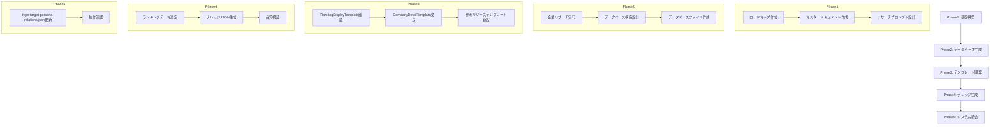

# 企業情報ランキングシステム構築ロードマップ

## 🎯 システム概要

企業情報データベースを構築し、就活生・転職希望者向けの企業ランキングコンテンツを生成するシステム。Type003形式でナレッジ化し、T013（就活生）・T014（転職希望者）ターゲット向けに展開。

## 📊 全体フロー図



## 📋 Phase1: 基盤構築（現在進行中）

### Step1.1: ロードマップ作成 ✅
- **ステータス**: 完了
- **成果物**: 本ドキュメント

### Step1.2: Type003用マスタードキュメント作成
- **必要アクション**: Claude Codeがドキュメント作成
- **内容**:
  - Type003の構造定義
  - 命名規則
  - テンプレート構成
  - 品質基準
- **成果物**: `Type003企業ランキングコンテンツマスタードキュメント.md`

### Step1.3: リサーチプロンプトテンプレート作成
- **必要アクション**: Claude Codeがプロンプト作成
- **種類**:
  1. 基本企業情報収集プロンプト
  2. 初任給ランキング用データ収集プロンプト
  3. 福利厚生ランキング用データ収集プロンプト
  4. ホワイト企業ランキング用データ収集プロンプト
- **成果物**: `企業情報リサーチプロンプト集.md`

## 📊 Phase2: データベース生成フロー

### Step2.1: 企業リサーチ実行
```
1. Claude Code: リサーチプロンプトを出力
2. ユーザー: 外部AIでリサーチ実行
3. ユーザー: 結果をClaude Codeに貼り付け
4. Claude Code: データ検証・整形
```

### Step2.2: データベース構造設計
- **必要データ項目**:
  ```
  - 企業基本情報（企業名、業界、規模等）
  - 給与情報（初任給、平均年収、ボーナス等）
  - 福利厚生情報（年次休暇、有給消化率、各種手当等）
  - 労働環境情報（平均残業時間、離職率等）
  - その他評価指標
  ```
- **成果物**: `企業情報データベース構造定義.md`

### Step2.3: データベースファイル作成
- **形式**: Markdown（副業データベースと同様）
- **成果物**: `企業情報データベース2025.md`

## 🎨 Phase3: テンプレート開発

### Step3.1: 既存テンプレート分析
- **対象**:
  - `RankingDisplayTemplate.tsx`
  - `CompanyDetailTemplate.tsx`
- **成果物**: `既存テンプレート分析レポート.md`

### Step3.2: CompanyDetailTemplate改良
- **改良点**:
  - パラメータグラフ対応
  - 2社同時表示対応（可能な場合）
- **成果物**: 改良版テンプレート実装

### Step3.3: 参考リソーステンプレート新設
- **機能**: 参考リソース一覧表示
- **成果物**: 新規テンプレート実装

## 📝 Phase4: ナレッジ生成フロー

### Step4.1: ナレッジ生成開始プロンプト
```
【ナレッジ生成フロー】
1. ユーザー: ランキングテーマを指定
2. ユーザー: 生成開始プロンプトとテーマを貼り付け
3. Claude Code: 
   - Type003マスタードキュメント参照
   - データベースから該当企業抽出
   - ナレッジJSON生成
4. Claude Code: 品質チェック実施
```

### Step4.2: ナレッジ生成プロンプトテンプレート
- **必要アクション**: Claude Codeが事前作成
- **内容**: テーマ指定でナレッジ自動生成
- **成果物**: `企業ランキングナレッジ生成プロンプト.md`

### Step4.3: 品質検証チェックリスト
- **項目**:
  - Type003構造準拠
  - データ正確性
  - ターゲット適合性
- **成果物**: `Type003品質チェックリスト.md`

## 🔧 Phase5: システム統合

### Step5.1: type-target-persona-relations.json更新
- **対象ターゲット**:
  - T013（就活生）
  - T014（転職希望者）
- **更新内容**: 生成したナレッジのID追加

### Step5.2: 動作確認
- **確認項目**:
  - ナレッジ正常読み込み
  - テンプレート正常動作
  - ランキング表示確認

## 📅 推定タイムライン

| Phase | 推定期間 | 主要成果物 |
|-------|---------|-----------|
| Phase1 | 1日 | マスタードキュメント、プロンプト集 |
| Phase2 | 2-3日 | 企業情報データベース |
| Phase3 | 2日 | 改良版テンプレート |
| Phase4 | 継続運用 | ナレッジJSON（随時生成） |
| Phase5 | 各生成時 | システム統合確認 |

## 🚀 即時実行可能アクション

1. **Type003マスタードキュメント作成**（Claude Code）
2. **リサーチプロンプト集作成**（Claude Code）
3. **ナレッジ生成プロンプト作成**（Claude Code）

## 📋 運用フロー（構築後）

### ランキングコンテンツ生成フロー
```
1. ランキングテーマ決定（例：初任給TOP10）
2. ナレッジ生成プロンプト使用
3. データベースから自動抽出・ランキング化
4. Type003形式でナレッジJSON生成
5. type-target-persona-relations.json更新
6. コンテンツ生成・確認
```

### データベース更新フロー
```
1. 新企業情報・更新情報の発見
2. 追加リサーチプロンプト実行
3. データベース更新
4. 既存ナレッジへの影響確認
```

## 🎯 成功指標

- **データベース品質**: 企業情報の正確性95%以上
- **ナレッジ生成効率**: 1テーマ30分以内で生成
- **コンテンツ品質**: Type003構造100%準拠
- **ターゲット適合性**: T013/T014向け表現最適化

---

このロードマップに従い、段階的にシステムを構築していきます。次のアクションは、Type003マスタードキュメントの作成です。